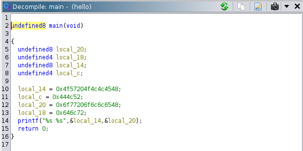

# Reverse engineering - Sujet de TP

## Installation

### Avec la VM
#### Installez VirtualBox

https://www.virtualbox.org/wiki/Downloads

Puis si vous êtes sur Linux :
`sudo dpkg -i <paquet>.deb`

#### Téléchargez ensuite les VM : // lien
- VM Kali (exos 1 et 2) : ~3.1 Go au téléchargement, 8 Go une fois déployée
- VM Windows (exo 3) : ~2.6 Go au téléchargement, 

#### Ouvrez l'application VirtualBox.
- cliquez sur 'Importer'
- dans le champ 'Fichier', sélectionnez l'archive de la VM qui vous intéresse selon l'exercice auquel vous êtes rendus (Kali pour les exercices 1 et 2, Windows pour l'exercice 3)
- cliquez sur 'Suivant' > 'Finir' (garder les paramètres par défaut proposés)
- après l'importation, la VM doit apparaître dans la liste de VirtualBox. Double-cliquez dessus pour la démarrer.
- login / mdp : 
	- VM Kali : kali / kali
	- VM Windows : win / win

### Sans la VM
Si vous ne souhaitez pas utiliser la VM, vous aurez besoin pour les exercices 1 et 2 de :
- Ghidra : https://github.com/NationalSecurityAgency/ghidra
- gcc
- un IDE

Pour l'exercice 3 :
- Windows
- dnSpy : https://github.com/dnSpy/dnSpy

Nous fournirons le contenu des exercices si vous êtes dans ce cas. C'est particulièrement pour éviter l'installation pénible de Ghidra que la VM est fournie, et pour que tout le monde dispose du même environnement.

## Ghidra

<details><summary>Fenêtres principales de Ghidra</summary>

#### Program Trees
Dans le coin supérieur gauche, une fenêtre présente les sections du programme : il s’agit de la section `Program Trees`. Si vous avez déjà utilisé un outil comme PeStudio, cela devrait vous sembler familier.


#### Symbol Tree
La section `Symbol Tree` est très utile : elle contient les importations, les exportations et les fonctions que le programme utilise pour exécuter ses activités malveillantes.


Lorsque Ghidra importe et analyse le programme, il tente d’attribuer un nom à certaines fonctions sur la base de l’analyse automatisée qu’il a effectuée. Dans l’image ci-dessus, l’une des fonctions est nommée « main ». 

**Si vous double-cliquez dessus, la fenêtre « Listing » principale de Ghidra est actualisée et affiche le code d’assembleur de la fonction main**

Nous pouvons également voir que certaines fonctions suivent une convention de dénomination générique qui commence par le préfixe « FUN_ », suivi d’une série de chiffres. Il s’agit de fonctions qui n’ont pas été définies par Ghidra et qui sont nommées « FUN_ » pour « function ». On leur attribue une valeur numérique hexadécimale qui représente l’emplacement de la fonction dans le code binaire.


#### Listing
La partie centrale de Ghidra (`Listing`) represente le code assembleur resultant au désassemblage du binaire du programme.


#### Decompile

Si vous cliquez sur une fonction comme « main », la fenêtre `Decompile` est mise à jour et contient maintenant des données. Cette fenêtre indique où Ghidra a tenté de convertir le code d’assemblage de la fenêtre « Listing » en C. L’analyste peut ainsi voir à quoi ressemblait le code de l’auteur.



</details>

### Manipulations utiles

Comme les noms des variables sont générés par ghidra, ils ne facilitent pas forcément la compréhension du code. Pour palier à ce problème, il est possible d'éditer le nom de ces variables en faisant Clique Droit > Rename Variable. 


Aussi, il se peut que ghidra n’arrive pas à correctement identifier le type de certaines données ou que vous vouliez changer comment ghidra les affiche (ex voir un String sous la forme de Bytes). Pour ce faire, utilisez Clique Droit > Data > type sur la donnée.


## Exercices
Sur la VM Kali, vous trouverez sur le bureau un dossier `Reversing` et 2 sous-dossiers, un par exercice.

### Exercice 1

Dans le dossier `1`, vous trouverez l'exécutable d'un programme `INSA_entry_test`. Vous pouvez l'exécuter dans un terminal. Le but de l'exercice est de passer les trois épreuves (récupérer 3 mots de passe).

**Puisque l'exécutable vérifie les mots de passe que vous entrez, vous allez décompiler son code avec Ghidra, et essayer de retrouver les mots de passe dans le code décompilé.**

Pour cela, ouvrez un terminal et exécutez la commande

```bash
ghidra
```

Dans la fenêtre qui s'ouvre, faites File > New project. Sélectionnez 'Non-shared project' puis 'Next'. Choisissez ensuite le répertoire où vous créez votre projet Ghidra, où vous le souhaitez, avec le nom que vous voulez.
Cliquez ensuite sur la tête d'hydre verte (CodeBrowser) dans le Tool Chest. Une nouvelle fenêtre va s'ouvrir.

Glissez-déposez l'exécutable `INSA_entry_test` sur cette fenêtre. Dans les pop-up successives, cliquez sur OK > Yes > Analyze > OK sans modifier les paramètres affichés. Vous allez maintenant pouvoir parcourir le code décompilé.

// image d'illustration

La fenêtre est subdivisée en plusieurs parties (cf. partie précédente sur Ghidra). A gauche, vous trouverez notamment le Symbol Tree. Ouvrez le dossier 'Functions' et double-cliquez sur 'main' pour trouver le point d'entrée de votre programme. Ghidra affiche dans la partie à droite le code reconstitué à partir de la décompilation.

<details><summary>Indice 1</summary>
Suite du walkthrough
</details>

<details><summary>Indice 2</summary>
Suite du walkthrough
</details>


### Exercice 2

Dans le dossier `2`, vous trouverez l'exécutable du 'malware' `totally_normal_binary` qui a chiffré un message que vous aviez reçu et n'avez pas eu le temps de lire, `encrypted.txt` (pour plus de détails sur le lore, lisez le `README.md` présent dans le dossier).

Pour déchiffrer le message, vous allez décompiler le malware afin de comprendre sa fonction de chiffrement. La fonction de déchiffrement sera la fonction inverse.

Dans Ghidra, de la même façon que précédemment, glissez-déposez l'exécutable `totally_normal_binary` et analysez-le pour pouvoir parcourir le code décompilé. Trouvez la fonction 'main'.

Dans cette fonction, vous devriez pouvoir identifier une fonction qui vous intéresse... Double-cliquez dessus pour afficher son code reconstitué. Tentez de comprendre la fonction pour trouver sa fonction inverse.

Vous n'aurez plus qu'à coder un programme C avec la fonction inverse, le compiler et l'utiliser sur `encrypted.txt` pour déchiffrer le message.
<details><summary>Solution</summary>
	
```cpp
#include <stdio.h>

#define KEY 0xABCD1234 // Clé XOR pour le chiffrement
#define SUB_BASE 3 // Valeur de base pour la soustraction

void decryptFile(const char *inputFile, const char *outputFile) {
    FILE *input = fopen(inputFile, "r");
    FILE *output = fopen(outputFile, "w");

    if (input == NULL || output == NULL) {
        perror("Error when opening files");
        return;
    }

    int c;
    int sub = 1;
    int counter = 0;
    while ((c = fgetc(input)) != EOF) {
        // Déchiffrement
        c = c - sub;
        c = c ^ KEY;

        fputc(c, output);

        // Variation périodique de la soustraction basée sur le counter
        sub = (SUB_BASE + (counter % 10)) % 21;
        counter++;
    }

    fclose(input);
    fclose(output);
}


int main() {
    const char *encryptedFile = "./encrypted.txt";
    const char *decryptedFile = "./decrypted.txt";

    // Déchiffrement
    decryptFile(encryptedFile, decryptedFile);
    printf("Successful decryption.\n");

    return 0;
}
```

A titre d'information, voici le code source de `totally_normal_binary`
```cpp
#include <stdio.h>

#define KEY 0xABCD1234 // Clé XOR pour le chiffrement
#define ADD_BASE 3 // Valeur de base pour l'addition

void encryptFile(const char *inputFile, const char *outputFile) {
    FILE *input = fopen(inputFile, "r");
    FILE *output = fopen(outputFile, "w");

    if (input == NULL || output == NULL) {
        perror("Error when opening files");
        return;
    }

    int c;
    int add = 1;
    int counter = 0;
    while ((c = fgetc(input)) != EOF) {
        // Chiffrement : XOR avec la clé et addition
        c = c ^ KEY;
        c = c + add;

        fputc(c, output);

        // Variation périodique de l'addition basée sur le counter
        add = (ADD_BASE + (counter % 10)) % 21;
        counter++;
    }

    fclose(input);
    fclose(output);
}

int main() {
    const char *inputFile = "./original_file.txt";
    const char *encryptedFile = "./encrypted.txt";

    encryptFile(inputFile, encryptedFile);
    printf("Successful encryption.\n");

    if(remove(inputFile) == 0) {
        printf("Original file successfully deteleted.\n");
    } else {
        printf("Unable to delete the original file.\n");
    }

    return 0;
}
```
</details>


### Exercice 3

Eteignez maintenant la VM Kali en fermant la fenêtre et lancez la VM Windows. Vous trouverez sur le bureau un dossier `dnSpy` et le dossier `Reverse`. Ouvrez `dnSpy` et lancez l'exécutable. Ouvrez `Reverse`, vous y trouverez un exécutable `UltimateVault`. Glissez-déposez `UltimateVault` sur la fenêtre de dnSpy. 

Dans cet exercice, de la même façon qu'avec Ghidra, vous pourrez parcourir le code décompilé, mais aussi utiliser un debugger pour marquer des points d'arrêts.

// image d'illustration

<details><summary>Indice 1</summary>
Suite du walkthrough
</details>

<details><summary>Indice 2</summary>
Suite du walkthrough
</details>


## Conclusion

Félicitations ! Vous êtes un agent émérite de l'I.N.S.A.

Pour retrouver votre espace de stockage libre initial, faites un clic droit sur les VM dans VirtualBox puis 'Supprimer' > 'Supprimer tous les fichiers'.

Supprimez également les archives (OVA) des VM là où vous les aviez enregistrées.

Désinstallez ensuite VirtualBox si vous le souhaitez.
